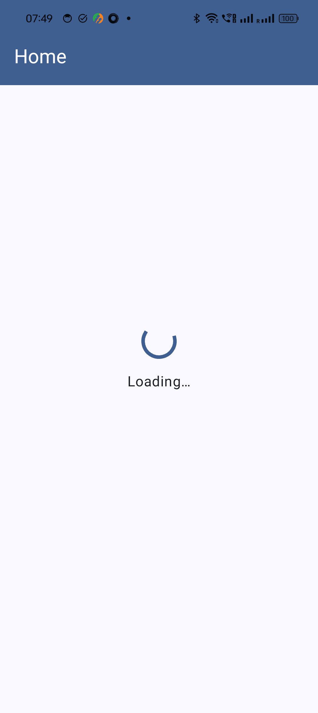
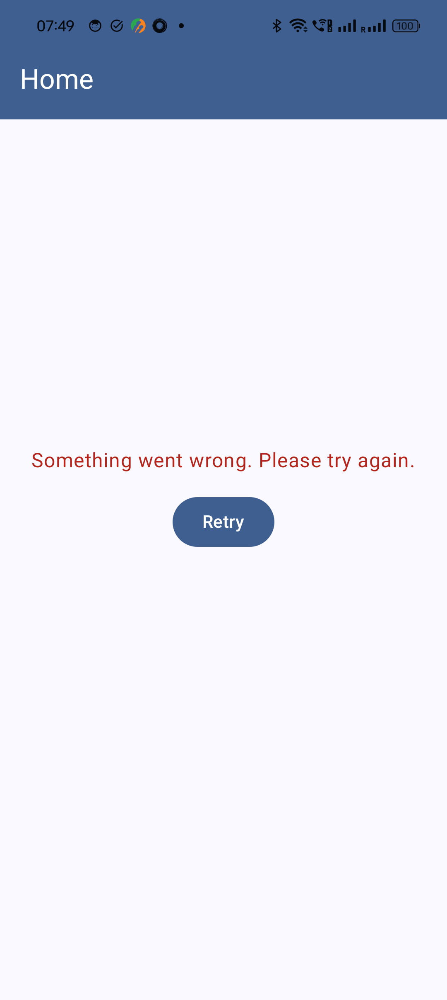

# Sample App (Keeper)

Keeper is a Sample Android App with the following below tech:

 ### Tech

 - Kotlin (100%)
 - MVVM pattern used.
 - HILT for Dependency Injection. 
 - Retrofit for Rest Api
 - OkHttp for Rest Api call.
 - Jetpack Compose for UI.
 - Coil for Async image. 
 - Paging, Navigation, Timber for log.
 - coroutine
 - state flow
 - Retry option on failure.
 - Basic Android Test case for Compose Screen.

## Screenshots

 &nbsp;&nbsp;&nbsp;&nbsp;
 &nbsp;&nbsp;&nbsp;&nbsp;
 &nbsp;&nbsp;&nbsp;&nbsp;
 &nbsp;&nbsp;&nbsp;&nbsp;
 

 
 

